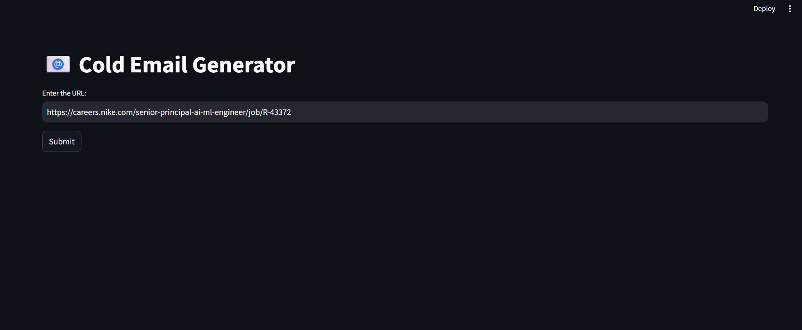

# 📬 Cold Mail Generator

An automated tool that analyzes a job posting directly from a URL and generates a cold email tailored to the posting, representing a company's strengths and citing relevant past achievements.

---

## 🚀 Project Overview

The **Cold Mail Generator** streamlines outreach by taking a job description URL as input, extracting and processing the content, and generating a personalized cold email using an LLM (Large Language Model). The generated email highlights your company’s relevant expertise and project history — leaving only copy-paste and send for the user.

---

## 🎯 Key Features

- 🔗 **URL Input:** Accepts a job description link directly.
- 🧠 **LLM-Powered:** Generates contextual, professional cold mails using a large language model.
- 🗂️ **Project Experience Referencing:** References past projects and company expertise that align with the job posting.
- 🧹 **Web Scraping & Text Cleaning:** Scrapes content and removes irrelevant boilerplate.
- 🖥️ **Streamlit UI:** User-friendly web app for input and copy-ready output.
- 🗄️ **ChromaDB Integration:** Stores and retrieves company/project data efficiently.

---

## 🛠️ Tech Stack

- 🧱 **LangChain** – For chaining and orchestrating the LLM prompts
- 🧠 **LLM via Groq (LLM API)** – For cold mail generation
- 📊 **Pandas** – For data handling and preprocessing
- 🧑‍💻 **Streamlit** – For front-end web interface
- 🧠 **ChromaDB** – For storing and retrieving past project data (vector database)

---

## 🧑‍💼 Use Case

Imagine you're a **B2B services company** looking to respond to job postings in a targeted manner. Instead of crafting cold emails manually:

1. 🔗 Paste the job post URL  
2. 🤖 The system scrapes, processes, and analyzes it  
3. 📨 A customized, LLM-generated email is displayed  
4. ✅ You simply **copy and send**

---

## 📷 Screenshots

---

## 🧪 Example Workflow

1. **User Input**: Paste the job post URL into the Streamlit interface  
2. **Data Extraction**: Web scraper fetches and cleans job content  
3. **LLM Prompting**: LangChain constructs prompt with job content + relevant company projects from ChromaDB  
4. **Output**: Cold email is displayed in text area  
5. **User Action**: Copy the email and send to client

